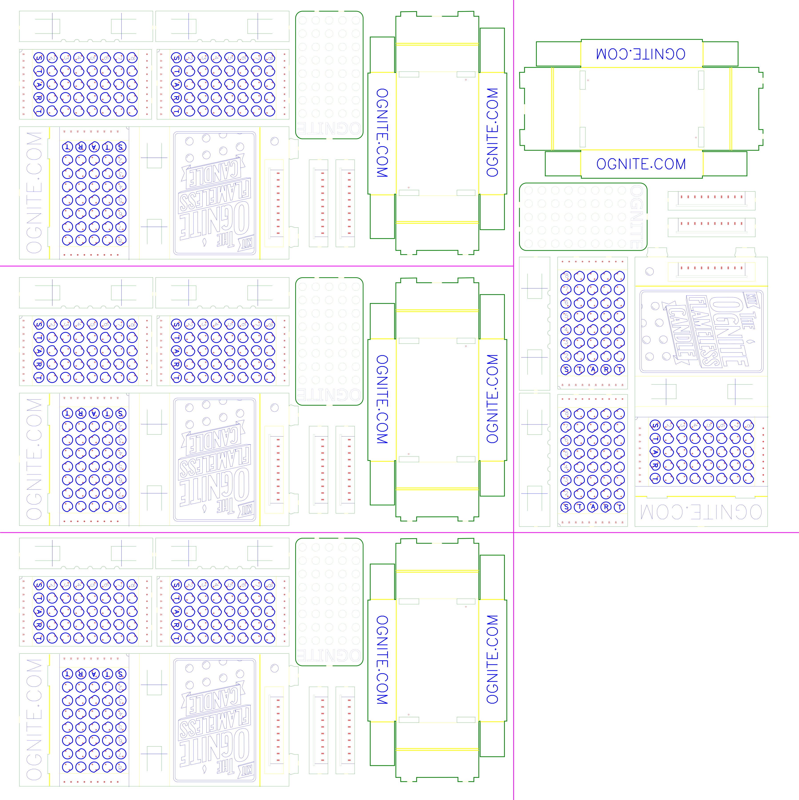

This repo contains all the design and contructon files for the Ognite Flameless Candle. 

More info on this project here...
http://ognite.com/

### Contents

The `parts` directory contains the individual design files for each part (i.e. box cover, box drawer, etc.). 

The `final` directory contains ready-to-cut sheets, including multi-unit production panels.

### How to cut

I use a 40 watt Full Spectrum laser cutter with the following settings...

The different colors represent...

|Color|What|
|-|-|
|Red|Holes that LED leads go though|
|Blue|Markings|
|Yellow|SCoring for fold lines|
|Green|Outline cut|
|Magenta|Final panel cut|

### Material

I've used various thickness chipboard sheets from amazon. 

http://amzn.to/2aBYE7N

http://amzn.to/2b404L2

Thin folds better, but thick makes for stronger drawers. 

I'd love to find a material that is the best of both. LMK if you find one!

